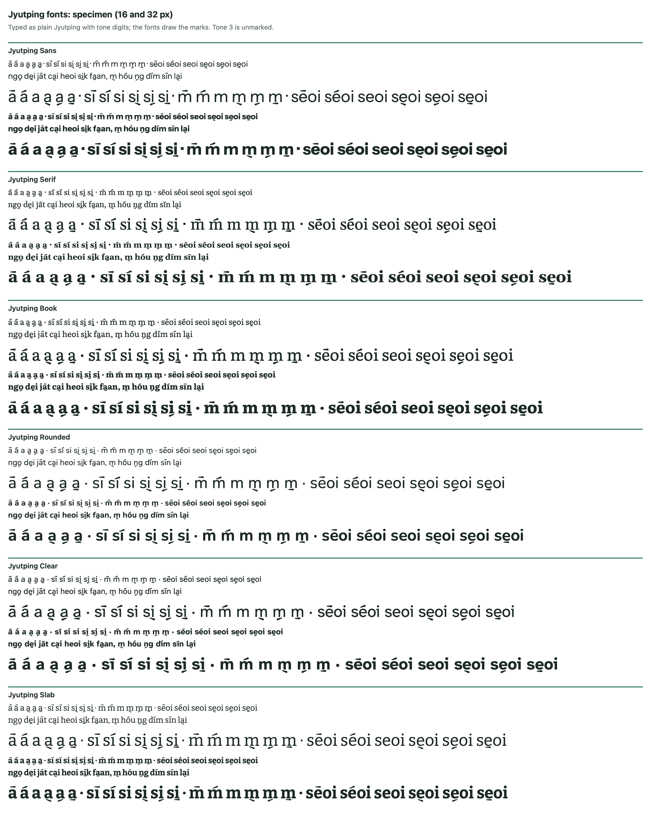

# Jyutping Fonts 1.000

Six font families that show **Cantonese tones as marks**. Type ordinary
Jyutping with tone numbers -- `nei5 hou2`, `sik6 faan6` -- and the font
draws a tone mark on the vowel and hides the number.



## The tone marks

Every mark is the same teardrop stroke. Its **shape** follows the pitch (level,
rising, falling) and its **position** gives the register (above the letter =
high, below = low). On slanted marks the heavy end always points away from the
letter.

| Tone | Pitch | Mark | Example |
|---|---|---|---|
| 1 | high level | level stroke above | `si1` |
| 2 | high rising | rising stroke above | `si2` |
| 3 | mid level | no mark | `si3` |
| 4 | low falling | falling stroke below | `si4` |
| 5 | low rising | rising stroke below | `si5` |
| 6 | low level | level stroke below | `si6` |

The mark goes on the first vowel of the syllable (`seoi5`: the e). `y` is never
marked (`jyu6`: the u), and syllables with no vowel mark the `m` or the `n` of
`ng` (`m4`, `ng5`, `hng6`).

## The families

| Font | Based on | Style |
|---|---|---|
| Jyutping Sans | Instrument Sans | clean, modern sans |
| Jyutping Serif | Gelasio | classic serif, in the manner of Georgia |
| Jyutping Book | Literata | book serif designed for reading on screens |
| Jyutping Rounded | Nunito | soft, rounded sans |
| Jyutping Clear | Atkinson Hyperlegible Next | sans designed for maximum legibility |
| Jyutping Slab | Bitter | slab serif |

Each comes in Regular and Bold, as `.ttf` (to install) and `.woff2` (for websites).

## Downloading

Click **Code > Download ZIP** at the top of this page for all the fonts, or open
a font file in `fonts/` and click the download button for just that one.

## Installing

* **Mac:** double-click a `.ttf` file and click **Install Font**. Install both
  Regular and Bold.
* **Windows:** right-click a `.ttf` file and choose **Install**.
* **iPhone and iPad:** fonts are installed through a font-manager app; the web
  fonts below work in Safari on any page that uses them.

Then choose the font (e.g. "Jyutping Sans") in Pages, Keynote, TextEdit, Word
and so on, and type Jyutping with tone numbers. The marks rely on the font's
*contextual alternates*, which most apps turn on by default. If the numbers
show instead of marks, turn contextual alternates on in the app's typography
settings.

## On a website

Copy the `fonts/` folder and `jyutping-fonts.css` to your site, then:

```html
<link rel="stylesheet" href="jyutping-fonts.css">
<span style="font-family: 'Jyutping Sans'">ngo5 dei6 heoi3 sik6 faan6</span>
```

## Good to know

* Use these fonts **for romanisation only**. The font treats any letters
  followed by a digit as Jyutping, so `covid19` shows as cōvid9.
* Tones 1-6. Older sources that number checked tones 7, 8 and 9 need
  converting to 1, 3 and 6 first.
* Text that already has Unicode tone marks (for example `sí`, `si̖`) is drawn
  with the same marks.
* The fonts do not include their originals' ligatures, old-style figures and
  similar features.
* Tone marks are the same weight in Bold as in Regular, by design, so every
  tone looks alike in weight.

## Licence and credits

All six families are licensed under the **SIL Open Font License 1.1**: free to
use, share, embed and modify, but not to sell on their own. The licence is in
[`OFL.txt`](OFL.txt), and each family's copy, with its own copyright lines, is
the `OFL-*.txt` file beside its fonts.

The Jyutping tone marks and typing rules are copyright 2026 Mark Lee. The
letters are the work of the original fonts' designers:

* **Jyutping Sans**: Instrument Sans -- Rodrigo Fuenzalida. Copyright 2022 The Instrument Sans Project Authors (https://github.com/Instrument/instrument-sans)
* **Jyutping Serif**: Gelasio -- Eben Sorkin. Copyright 2022 The Gelasio Project Authors (https://github.com/SorkinType/Gelasio)
* **Jyutping Book**: Literata -- Latin by Veronika Burian and Jose Scaglione. Greek by Irene Vlachou. Cyrillic by Vera Evstafieva. Copyright 2017 The Literata Project Authors (https://github.com/googlefonts/literata)
* **Jyutping Rounded**: Nunito -- Vernon Adams. Copyright 2014 The Nunito Project Authors (https://github.com/googlefonts/nunito)
* **Jyutping Clear**: Atkinson Hyperlegible Next -- Elliott Scott, Megan Eiswerth, Linus Boman, Theodore Petrosky, Letters from Sweden. Copyright 2020-2024 The Atkinson Hyperlegible Next Project Authors (https://github.com/googlefonts/atkinson-hyperlegible-next)
* **Jyutping Slab**: Bitter -- Sol Matas, and Bitter project Authors. Copyright 2011 The Bitter Project Authors (https://github.com/solmatas/BitterPro)

These fonts are modified versions with new names. They are not made, endorsed
or supported by the designers or owners of the original fonts. Gelasio,
Literata and Bitter are trademarks of their respective owners.
